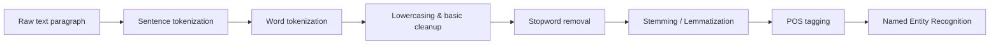

# Full Stack Gen AI

Full Stack Gen AI V2 is a learning and experimentation workspace for modern NLP and GenAI techniques. It currently focuses on:

- Classic word embeddings (custom word2vec)
- Core NLP preprocessing (tokenization, stopwords, stemming, lemmatization)
- Playing with small text corpora to understand representation learning

---

## Project Structure

- [main.py](main.py) – minimal entry point (prints a greeting); reserved for future app logic.
- [april12](april12)
	- [custom_word2vec.ipynb](april12/custom_word2vec.ipynb) – trains and explores a custom `gensim` word2vec model on small story texts from `data/`.
	- [data](april12/data)
		- [story1.txt](april12/data/story1.txt) – sample text corpus 1.
		- [story2.txt](april12/data/story2.txt) – sample text corpus 2.
- [april_11](april_11)
	- [word2vec.ipynb](april_11/word2vec.ipynb) – earlier word2vec experimentation (embeddings, similarity, analogies, etc.).
- [NLP](NLP)
	- [tokenization](NLP/tokenization)
		- [tokenizations.ipynb](NLP/tokenization/tokenizations.ipynb) – basic tokenization techniques.
		- [stopwords.ipynb](NLP/tokenization/stopwords.ipynb) – stopword removal experiments.
		- [stemming_lemmatization.ipynb](NLP/tokenization/stemming_lemmatization.ipynb) – stemming vs. lemmatization.
		- [partsofspeech_tagging.ipynb](NLP/tokenization/partsofspeech_tagging.ipynb) – POS tagging with NLTK (tags for words, filtering stopwords).
		- [name_entity_recognition.ipynb](NLP/tokenization/name_entity_recognition.ipynb) – basic named entity recognition (NER) using NLTK’s `ne_chunk`.

Supporting files:

- [pyproject.toml](pyproject.toml) – project metadata and main dependency list (Python ≥ 3.11).
- [requirements.txt](requirements.txt) – pip-style dependency list, useful for quick environment setup.

---

## Key Dependencies

Core libraries used across notebooks and future scripts:

- `gensim` – training and using word2vec and other embeddings.
- `numpy`, `pandas`, `scipy` – numerical and data utilities.
- `scikit-learn` – ML utilities (e.g., vector operations, evaluation).
- `nltk` – tokenization, stopwords, stemming/lemmatization helpers.
- `sentence-transformers`, `huggingface` – modern transformer-based embeddings (for later experiments).
- `langchain`, `langchain-community`, `langchain-openai`, `langchain-google-genai` – building LLM/GenAI workflows.
- `ipykernel` – Jupyter kernel support for notebooks.

---

## Setup

1. Clone the repo and create a virtual environment (recommended):

	 ```bash
	 python -m venv .venv
	 source .venv/bin/activate  # macOS / Linux
	 # On Windows: .venv\\Scripts\\activate
	 ```

2. Install dependencies (choose one):

	 Using `pyproject.toml` with uv or pip:

	 ```bash
	 # with uv (recommended if installed)
	 uv sync

	 # or with pip
	 pip install -r requirements.txt
	 ```

3. Ensure you are using Python ≥ 3.11 (as specified in pyproject.toml).

---

## Running Things

- Run the simple entry script:

	```bash
	python main.py
	```

- Work with notebooks:

	1. Activate your virtual environment.
	2. Start Jupyter (or VS Code’s notebook interface):

		 ```bash
		 python -m ipykernel install --user --name full-stack-genai-v2
		 ```

	3. Open and run notebooks such as:
		 - [april12/custom_word2vec.ipynb](april12/custom_word2vec.ipynb)
		 - [april_11/word2vec.ipynb](april_11/word2vec.ipynb)
		 - [NLP/tokenization/tokenizations.ipynb](NLP/tokenization/tokenizations.ipynb)

---

## Workflows

### 1. NLP Preprocessing Workflow



- Implemented across:
	- [NLP/tokenization/tokenizations.ipynb](NLP/tokenization/tokenizations.ipynb)
	- [NLP/tokenization/stopwords.ipynb](NLP/tokenization/stopwords.ipynb)
	- [NLP/tokenization/stemming_lemmatization.ipynb](NLP/tokenization/stemming_lemmatization.ipynb)
	- [NLP/tokenization/partsofspeech_tagging.ipynb](NLP/tokenization/partsofspeech_tagging.ipynb)
	- [NLP/tokenization/name_entity_recognition.ipynb](NLP/tokenization/name_entity_recognition.ipynb)

### 2. Word2Vec Experiment Workflow

```mermaid
flowchart LR
		A[Load raw stories from data/] --> B[Clean & tokenize text]
		B --> C[Train custom gensim Word2Vec model]
		C --> D[Explore embeddings: similarity, analogies]
		D --> E[Inspect "odd one out" and vector relationships]
```

- Implemented in:
	- [april12/custom_word2vec.ipynb](april12/custom_word2vec.ipynb)
	- [april_11/word2vec.ipynb](april_11/word2vec.ipynb)

### 3. Notebook Overview (Concept Map)

| Notebook | Focus | Key Concepts |
|---------|-------|--------------|
| [NLP/tokenization/tokenizations.ipynb](NLP/tokenization/tokenizations.ipynb) | Tokenization | Sentence/word tokenization, NLTK basics |
| [NLP/tokenization/stopwords.ipynb](NLP/tokenization/stopwords.ipynb) | Stopwords | Stopword lists, filtering tokens |
| [NLP/tokenization/stemming_lemmatization.ipynb](NLP/tokenization/stemming_lemmatization.ipynb) | Normalization | Stemming vs. lemmatization, trade-offs |
| [NLP/tokenization/partsofspeech_tagging.ipynb](NLP/tokenization/partsofspeech_tagging.ipynb) | POS tagging | Tags for words, filtering content words |
| [NLP/tokenization/name_entity_recognition.ipynb](NLP/tokenization/name_entity_recognition.ipynb) | NER | Named entities, chunking with ne_chunk |
| [april12/custom_word2vec.ipynb](april12/custom_word2vec.ipynb) | Custom embeddings | Training Word2Vec, exploring similarity |
| [april_11/word2vec.ipynb](april_11/word2vec.ipynb) | Embedding sandbox | Classic word2vec experiments |

---

## Notes

- Some older `gensim` APIs (e.g., `doesnt_match`) have changed or been removed in gensim 4; notebooks may include small helper functions to replicate legacy behavior.
- This repository is intended for experimentation and learning; breaking changes to notebooks are possible as you iterate.